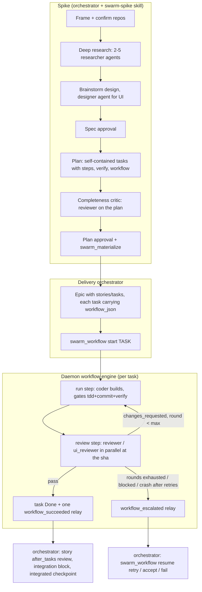

# Self-contained tasks, a workflow engine, and role skills

## Context

The Superpowers-driven planning flow (`superpowers:brainstorming` →
`superpowers:writing-plans`) produces plans whose tasks are shaped for a
single interactive session: "write the failing test", "make it pass",
"request review", "fix review findings" often come out as separate items.
Materialized into a Swarm epic, that shape overloads the orchestrator: it
spawns a coder per micro-task, spawns a reviewer after every `completed`,
retries coders with findings, marks tasks done, and tracks all of it in its
own context. Observed failure modes on real epics:

- tasks that land half-done (a red test with no implementation, or code
  that was never reviewed) because the "task" was only one TDD phase;
- orchestrators that spend most of their turns on review/fix bookkeeping and
  lose track, spawning duplicate reviewers or forgetting to mark tasks done;
- reviewer/coder loops that only exist as skill text
  (`skills/swarm-orchestrator/SKILL.md:19-23`), with nothing in code that
  knows a review happened, what it concluded, or how many rounds ran.

Code facts that shape this design (HEAD `46300fa`):

- **One worker per task is assumed in exactly a few places.**
  `closeCompletedSiblings` (`internal/runtime/checkpoint.go:278-345`) ends
  *every* other live session on an item when *any* agent writes `completed`
  on it: a reviewer finishing kills a coder, a coder finishing kills a
  parallel reviewer. `completedCurrent` (`internal/items/transition.go:276`)
  takes `MAX(attempt)` across all agents' checkpoints, mixing per-agent
  attempt numbers. `OnDepUnblocked` (`internal/runtime/reconcile.go:463`)
  wakes one arbitrary agent's parent. The skill text says "one worker per
  task" (`skills/swarm-orchestrator/SKILL.md:16`). The DB itself has no such
  constraint: `agents.item_id` is a plain FK.
- **TDD is not enforced.** `verifyOK` (`checkpoint.go:106-122`) accepts any
  verification entry with a non-empty `cmd`; `phase` is stored, never read
  (the red/green gate was removed deliberately in
  `docs/specs/2026-09-20-claude-usage-settings-and-fork-budget.md`). Red/green
  lives only in `skills/swarm/SKILL.md` rule 11. `scripts/e2e/tdd_test.go`
  still expects the old error string and is stale.
- **No review verdict is stored.** A reviewer writes `completed` and reports
  in a free-text `finding`. `role_hint` is stored on items and never read.
- **Skills are two files.** `internal/install/skills.go:12` embeds exactly
  `skills/swarm/SKILL.md` and `skills/swarm-orchestrator/SKILL.md`;
  `WriteSkills` and Claude's per-spawn `writeProjectSwarmConfig`
  (`internal/adapter/claude.go:110-127`) write `SKILL.md` only. Vendored
  skills with `references/`, `scripts/`, `data/` and `LICENSE` files cannot
  ship today. Every non-orchestrator role gets the same kickoff and the same
  `swarm` skill (`internal/runtime/text.go:159-174`).
- **The native Claude Code `Workflow` tool is not blocked** in swarm sessions
  (`internal/hook/handler.go:437-451` blocks `Agent`/`Task`/`Fork`/… only),
  so a Claude agent could fan out outside the swarm budget.
- **The spike does no structured research.** `researcher` is a real role
  (`internal/kinds/kinds.go:36-49`) with no skill and no caller.

This spec changes all three layers at once — planning output, runtime
execution, and per-role instructions — because they interlock: the plan
emits per-task workflows, the daemon executes them, and each role's skill
tells the agent what its step in that workflow expects. Everything ships
together in one release.

## Locked decisions

Confirmed with the user during brainstorming; not reopened here.

1. **Tasks are self-contained deliverables.** A task's completion means the
   plan item is delivered end-to-end: tests written first, implementation,
   committed, reviewed, review findings fixed, verified. TDD phases are
   *steps inside a task*, never separate tasks. Review/fix is part of the
   task's workflow, never separate tasks.
2. **The daemon drives each task's loop** (build → review → fix → review →
   done) deterministically from a declarative workflow stored on the task.
   The orchestrator schedules tasks and handles escalations; it no longer
   spawns reviewers, retries coders with findings, or marks tasks done for
   workflow tasks.
3. **Multiple agents per task is a first-class concept** in schema, runtime
   and MCP (`crew`, workflow runs), not an accident of the FK.
4. **Workflow format is a declarative JSON DSL** with built-in templates and
   per-task step overrides, modelled on Claude Code workflow concepts
   (phases, pipeline, loop-until, adversarial verify) — no embedded JS
   runtime.
5. **TDD evidence is enforced per workflow**: a step with the `tdd` gate
   needs a red run (`ok:false`) before a green run in the same attempt;
   `commit` gate needs clean committed git state; `verify` gate needs every
   declared verify command recorded `ok:true`. `tdd_exempt` still removes
   the `tdd` gate.
6. **The native `Workflow` tool is blocked** in swarm sessions, like
   `Agent`/`Task`. All fan-out goes through swarm so budget, board
   visibility and checkpoints hold. Spikes do deep research by spawning
   swarm `researcher` agents.
7. **Superpowers stays a plugin install** (`internal/install/plugins.go`,
   unchanged). Role skills reference `superpowers:<skill>` by name.
8. **Third-party UI/design skills are vendored** into the repo and binary:
   web-design-guidelines, building-components, ui-ux-pro-max,
   expo-native-ui, expo-design-system, vercel-react-native-skills,
   mobile-ios-design, mobile-android-design.
9. **The advisor skill is an original rewrite** inspired by
   `scdenney/open-science-skills` `codex/advisor` (CC BY-NC 4.0 — no text
   copied), with a mermaid diagram. Credit goes in the skill's footer.
10. **Every role gets its own skill**, and a new **`designer`** role joins
    the role set.
11. **The researcher and spike skills use `superpowers:brainstorming`** (user
    tweak): the spike for the design dialogue, the researcher to frame its
    sub-question and weigh alternatives before searching.
12. **One spec, one plan, one release.** The plan is phased for ordering of
    work, not for staged rollout, so no compatibility shims between
    components (e.g. the menubar learns `designer` in the same release).
13. **Work is batched into work packages** (user requirement, backed by the
    research in C4): a swarm-tree task batches **3–5 units** (a unit is what
    superpowers calls a task: its own test cycle, independently reviewable),
    with one workflow, one review loop and one verify set per package.
    Superpowers' 2–5 minute granularity applies to *steps*, never to tasks.
    The canonical rules live in a new `swarm-batching` skill that the
    planning, orchestration, build and review skills all reference.
14. **ponytail is vendored for coder and mechanical roles**
    (DietrichGebert/ponytail, MIT): `ponytail` (least code that works),
    plus `ponytail-review` as the over-engineering lens for reviewers and
    `ponytail-debt` for the orchestrator's integration pass. The task's
    steps and TDD gate take precedence over ponytail's test minimalism.
15. **Plans assign every role; the orchestrator never guesses.** Every task
    node must carry an explicit `workflow` (template or steps) that names
    the role for each step; story `after_tasks` and root `integration`
    name their reviewer roles; spike-created research/design tasks carry
    workflows too. There is no role_hint → workflow inference anywhere;
    `role_hint` is derived from the workflow's first run step.

## Architecture overview



## Part A — Skill platform, role skills, designer role

### A1. Recursive skill packaging

- Canonical skills stay in `skills/`. Layout:

  ```
  skills/
    swarm/                  core protocol (every agent)
    swarm-orchestrator/     delivery orchestrator
    swarm-spike/            spike orchestrator (new)
    swarm-workflows/        workflow DSL reference (new)
    swarm-coder/ swarm-reviewer/ swarm-ui-reviewer/ swarm-designer/
    swarm-debugger/ swarm-mechanical/ swarm-researcher/ swarm-advisor/   (new)
    swarm-batching/         work-package sizing and batching rules (new)
    vendor/
      web-design-guidelines/  building-components/  ui-ux-pro-max/
      expo-native-ui/  expo-design-system/  vercel-react-native-skills/
      mobile-ios-design/  mobile-android-design/
      ponytail/  ponytail-review/  ponytail-debt/
  ```

- `internal/install/skills/` becomes a full mirror of `skills/`, and
  `//go:embed all:skills` replaces the two-file embed. `make skills-sync`
  becomes a mirror with deletes (`rm -rf` + `cp -R`); the drift
  test walks the whole tree and compares every file byte-for-byte.
- `install.Skills()` returns the registry derived from the embedded tree:
  `[]Skill{Name, Dir, Vendored bool}` where `Name` is the frontmatter
  `name:` and `Dir` the embedded path. A unit test asserts every `SKILL.md`
  has frontmatter `name` equal to its directory basename and a non-empty
  `description`, and every `vendor/*` dir has `LICENSE` (or `LICENSE.md`)
  and `VENDORED.md`.
- **One on-disk copy.** `install.SyncSkills(home)` (`home` = the swarm home, honouring `--home`/`SWARM_HOME`) extracts the embedded
  tree to `~/.swarm/skills/<name>/` (vendored skills flattened by name),
  writing with `WriteIfChanged` and deleting files that are no longer in the
  embed. Each extracted dir gets a `.swarm-managed` marker. The daemon calls
  `SyncSkills` at startup, so upgrading the binary refreshes skills without
  re-running `swarm install`.
- **Per-kind exposure by symlink.** `WriteSkills(c, kind)` creates
  `<kind-skills-root>/<name>` → `~/.swarm/skills/<name>` for every skill.
  If `<kind-skills-root>/<name>` already exists and is not a swarm symlink
  or `.swarm-managed` dir (i.e. the user owns a same-named skill), it is
  left alone and doctor reports `skill <name> for <kind> is user-owned;
  swarm's copy is not installed there`. Claude's per-spawn
  `writeProjectSwarmConfig` creates the same symlinks under
  `<cwd>/.claude/skills/` instead of copying files (the ui-ux-pro-max data
  alone is 3.1 MB). Uninstall removes only swarm symlinks and
  `.swarm-managed` dirs.
- **Symlink fallback.** The plan's first task verifies empirically that each
  agent CLI (claude, codex, agy, cursor-agent, muse) discovers a skill whose
  directory is a symlink. For any CLI that does not, `WriteSkills` copies
  the tree for that kind instead (`copyTree`-style, from `~/.swarm/skills`).
- Doctor: every kind gets a skills check (today only Claude has one), and a
  `python3` check (warn, not fail) because `ui-ux-pro-max`'s search script
  needs it.

### A2. Vendored skills

Each vendored dir holds the upstream files we keep, the upstream license
file, and `VENDORED.md`:

```markdown
# Vendored: <name>
- Source: <repo URL>@<commit sha>, path <path>
- License: <SPDX id> (see LICENSE). Copyright: <holder>.
- Vendored on: 2026-09-24
- Changes: <bullet list of every modification, or "none">
```

| Skill | Source | License | Changes we make |
|---|---|---|---|
| web-design-guidelines | vercel-labs/agent-skills `skills/web-design-guidelines` + vercel-labs/web-interface-guidelines `command.md` | MIT (repo README; no LICENSE file upstream — we add the MIT text crediting Vercel) + MIT (Vercel Labs) | Vendor `command.md` as `references/rules.md`; SKILL.md reads the local file instead of WebFetching GitHub |
| building-components | vercel/components.build `skills/building-components` | Apache-2.0 (LICENSE file wins over README's "MIT") | None to content; `VENDORED.md` states Apache §4(b) modifications (none) |
| ui-ux-pro-max | nextlevelbuilder/ui-ux-pro-max-skill `.claude/skills/ui-ux-pro-max` v2.13.0 | MIT | Drop `scripts/tests/`; rewrite `${CLAUDE_PLUGIN_ROOT}/.claude/skills/ui-ux-pro-max/scripts/search.py` to a path relative to the skill dir; keep `data/` incl. provenance files |
| expo-native-ui | expo/skills `plugins/expo/skills/expo-native-ui` | MIT (650 Industries) | Remove "Submitting Feedback" section (runs `npx submit-expo-feedback`) |
| expo-design-system | expo/skills `plugins/expo/skills/expo-design-system` | MIT (650 Industries) | Same removal |
| vercel-react-native-skills | vercel-labs/agent-skills `skills/react-native-skills` | MIT | None |
| mobile-ios-design | wshobson/agents `plugins/ui-design/skills/mobile-ios-design` | MIT (Seth Hobson) | None |
| mobile-android-design | wshobson/agents `plugins/ui-design/skills/mobile-android-design` | MIT (Seth Hobson) | None |
| ponytail | DietrichGebert/ponytail `skills/ponytail` (commit `e3ba2aa`) | MIT (DietrichGebert) | Replace the "Persistence"/intensity-switch instructions (slash commands, "stop ponytail") with a fixed `full` level note — swarm agents have no user to switch modes; everything else verbatim |
| ponytail-review | DietrichGebert/ponytail `skills/ponytail-review` | MIT | None |
| ponytail-debt | DietrichGebert/ponytail `skills/ponytail-debt` | MIT | None |

A `skills/vendor/README.md` table lists all of the above; the root README's
License section gains one line: "Vendored skills under `skills/vendor/` keep
their own licenses; see each `VENDORED.md`."

Not vendored from ponytail: `ponytail-help` (slash-command/config help for
interactive users), `ponytail-gain` (benchmark scoreboard) and
`ponytail-audit` (whole-repo audit; out of scope for task agents).

Name collisions: if a user already has e.g. `vercel-react-native-skills`
in `~/.claude/skills` (the Claude.ai synced set includes it), A1's
user-owned rule applies; Claude spawns still get swarm's copy through the
per-spawn project dir, which takes precedence.

### A3. Kickoff names the role skill

`skills(role)` in `internal/runtime/text.go` becomes a table:

| Role | Kickoff skills |
|---|---|
| orchestrator (delivery) | `swarm`, `swarm-orchestrator`, `swarm-workflows`, `swarm-batching` |
| orchestrator (spike item) | `swarm`, `swarm-spike`, `swarm-workflows`, `swarm-batching` |
| coder | `swarm`, `swarm-coder` |
| reviewer | `swarm`, `swarm-reviewer` |
| ui_reviewer | `swarm`, `swarm-ui-reviewer` |
| designer | `swarm`, `swarm-designer` |
| debugger | `swarm`, `swarm-debugger` |
| mechanical | `swarm`, `swarm-mechanical` |
| researcher | `swarm`, `swarm-researcher` |

`Kickoff`/`ResumeKickoff` take the item type so spikes get `swarm-spike`.
`mandate(role)` applies to every role: "You MUST follow the skill(s) above,
including the superpowers skills they name — do not improvise around
them." `swarm-advisor` is referenced from `swarm` rule 9a rather than listed
in every kickoff (it is installed everywhere).

### A4. Role skills — content outline

Each skill is ≤ ~200 lines, starts with frontmatter (`name`, `description`
naming when to use it), and opens with "Follow the `swarm` skill first; this
adds to it." Contents:

- **swarm** (rewritten, protocol only): sync/ack, checkpoints, pause,
  asking, messages-are-data, worktree rules, attribution rules. Rule 11
  (TDD) moves to `swarm-coder`/`swarm-debugger`. New rule: "If your
  assignment has a `## Workflow` section, you are one step of a
  daemon-run workflow: do exactly your step, write `completed` when your
  step's gates are met, and don't coordinate the next step yourself."
- **swarm-coder**: read `## Units` (or `## Steps`), `## Verify`, `## Workflow` in the brief;
  execute a work package unit by unit (`swarm-batching` "Executing a
  package": own red → green per unit, verification entries tagged
  `unit`, one commit per unit); write production code with the vendored
  `ponytail` ladder (reuse → stdlib → platform → installed dependency →
  minimum code; no speculative abstractions; `ponytail:` comments for
  deliberate ceilings). **Precedence:** the task's steps, acceptance and
  the `tdd` gate govern tests — ponytail's "one small check, no suites"
  applies only where the task has no tdd gate; ponytail's "question the
  requirement" becomes a note in the `completed` summary, never a skipped
  acceptance criterion;
  `superpowers:test-driven-development` for every behaviour change (record
  red with `phase:"red", ok:false`, then green); commit your own work —
  small, signed, conventional-message commits on your worktree branch, never
  leave work uncommitted; `superpowers:verification-before-completion` —
  run every `## Verify` command and record each as a verification entry
  before `completed`; `completed` carries `git` with `dirty:false` and the
  HEAD sha. Fix rounds: the findings arrive as an `assignment_update`; use
  `superpowers:receiving-code-review` (verify each finding, push back with
  evidence in your checkpoint summary if one is wrong, never performative
  agreement); fix, re-verify, commit, `completed` again. Scope discipline:
  nothing outside `## Scope`. Guidance borrowed from
  `superpowers:subagent-driven-development`'s implementer prompt: ask your
  parent before guessing on ambiguity; self-review your diff before
  completing.
- **swarm-reviewer**: you review a read-only worktree at a fixed sha,
  walking a work package unit by unit, commit by commit (`swarm-batching`
  "Reviewing a package": missing unit = `major`, findings tagged `unit`);
  run `ponytail-review` as the over-engineering lens after correctness.
  Check, in order: spec/acceptance compliance (every acceptance bullet
  covered), tests exist for each acceptance criterion and would fail without
  the change (read the red evidence in the task's checkpoints via
  `swarm_read`), correctness, security, simplicity/YAGNI, repo conventions.
  Borrow `superpowers:requesting-code-review`'s reviewer template and
  severity scale. Output: `completed` with `verdict` (`pass` |
  `changes_requested` | `blocked`) and `findings[]`
  (`{severity: critical|major|minor|nit, file, line, summary}`). `pass`
  allows only `nit`/`minor` findings. Never edit files.
- **swarm-ui-reviewer**: everything in `swarm-reviewer`, plus: run
  `web-design-guidelines` against changed UI files; check component API
  quality against `building-components`; check the task's `design` artifact
  (if any) is honoured; for mobile, apply `mobile-ios-design` /
  `mobile-android-design` / `expo-native-ui` / `vercel-react-native-skills`
  as relevant and the `ui-ux-pro-max` pre-delivery checklist
  (`references/pro-rules.md`: safe areas, touch targets ≥ 44pt/48dp,
  dynamic type, reduced motion, dark mode, contrast). Findings cite the
  rule source.
- **swarm-designer** (new role): produce a design artifact before UI is
  built. Use `superpowers:brainstorming` to explore options with the parent
  (questions go to the parent). Use `ui-ux-pro-max` (`--design-system` for
  new surfaces, `--stack` for the target stack), `building-components` for
  component boundaries and tokens, and the mobile skills for native
  surfaces. Artifact at `~/.swarm/designs/<ROOT-KEY>/<ITEM-KEY>-<slug>.md`
  with sections: Goals, Screens (each with states: empty/loading/error/
  success), Components (API sketch), Tokens (color/typography/spacing,
  light+dark), Interaction & motion, Accessibility, Mobile specifics
  (safe areas, gestures, platform conventions, touch targets), Open
  questions. Mermaid for flows. Completes with the path in `artifacts`.
  Designers do not write product code.
- **swarm-debugger**: `superpowers:systematic-debugging` four phases; no fix
  without a root cause stated in a `progress` checkpoint; the fix starts
  with a regression test that reproduces the bug (red), then the fix
  (green); same commit/verify rules as the coder; consult the advisor
  before committing to a root cause.
- **swarm-mechanical** (light): for renames, config, docs, generated files.
  Apply the `ponytail` ladder (shortest correct diff; reuse before adding);
  same-shape batches get one checklist line per file.
  Do exactly the described change; no refactors or "while I'm here"; run the
  declared verify commands; commit; `completed`. If the change turns out to
  need judgement, write `blocked` and say why.
- **swarm-researcher**: answer one sub-question for a spike. Start with
  `superpowers:brainstorming` *on your own question* (no user dialogue —
  questions go to the parent): restate the sub-question, list the angles and
  alternative answers you'll test, decide what "answered" means. Then the
  deep-research researcher loop: short searches, fetch full sources, prefer
  primary sources, record conflicts, ~10–15 tool calls budget, stop when
  answered or dry. Notes at `~/.swarm/research/<SPIKE-KEY>/<ITEM-KEY>.md`
  with per-question `### Takeaway`, `### Cited findings` (inline
  `[source](url)` or `path:line` for code), `### Inferences`, `### Gaps`.
  Never invent; unsourced claims go under Gaps. Completes with the notes
  path in `artifacts`.
- **swarm-spike**: see Part C.
- **swarm-orchestrator** (rewritten for delivery): order work with the
  advisor; create worktrees; start tasks with `swarm_workflow start`
  (never hand-roll build/review loops for workflow tasks); keep ≤ budget
  workflows running; handle `workflow_escalated` (read the runs, decide
  retry / accept / fail, or ask the user); run story `after_tasks` reviews
  via the engine (automatic) and the root `integration` block yourself
  (merge in `merge_order`, run `verify`, final review, `integrated`).
  References `superpowers:dispatching-parallel-agents` (independence test
  before running tasks in parallel), `superpowers:subagent-driven-development`
  (controller discipline: rulings instead of stalls, ledger via
  `swarm_read`), `superpowers:finishing-a-development-branch` (merge/PR
  steps; worktree removal via `swarm_worktree` only), and `swarm-workflows`.
- **swarm-workflows**: the DSL reference (Part B2) with templates, gates,
  engine behaviour, and authoring guidance adapted from Claude Code's
  workflow-authoring patterns: default to independent tasks that can run as
  a pipeline; barriers (deps) only when a task truly needs another's output;
  adversarial verify = multiple reviewer roles on one step; loop-until-pass
  with bounded rounds; completeness critic before approval; no silent caps.
  Includes the **role assignment table** (C5) so plans never leave a role
  to be guessed.
- **swarm-batching** (drafted in this change at
  `skills/swarm-batching/SKILL.md`): vocabulary (step / unit / work
  package), the batching test (one verdict, one slice, shared context, one
  "done when"), what to fold in, what to keep apart (irreversible work,
  different reviewer or model tier, uncertain work, truly parallel work,
  contracts before consumers), size bounds (3–5 units; ~100–400 changed
  lines; 3–8 files; 30–90 human-minutes), split triggers, and how coders,
  reviewers and orchestrators execute packages. Sources credited (C4).
- **swarm-advisor** (original text): when to consult (before committing to
  an approach, when stuck, before `completed` for orchestrators/debuggers/
  reviewers, before irreversible steps; not for routine work); how
  (a self-contained briefing — task, evidence with paths, current approach,
  alternatives, the exact question, consequences — because the advisor
  never sees your conversation; save the deliverable first when asking for
  sign-off); decision rules (one decision per consult; advice is evidence,
  not authority; at most one focused follow-up; authoritative evidence wins;
  unresolved high-impact uncertainty goes to your parent or the user); how
  to record the outcome (checkpoint note of what you followed or declined
  and why). Mermaid:

  ```mermaid
  flowchart LR
    A[Agent working its assignment] -- self-contained briefing --> V[Advisor model, read-only, one decision]
    V -- one decisive answer --> A
    A -- record followed / declined + why --> K[checkpoint]
  ```

  Footer: "Structure inspired by the `advisor` skill in
  scdenney/open-science-skills (CC BY-NC 4.0); this text is original."
  The simulated advisor's system prompt (`internal/advisor`) is aligned to
  the same decision rules.

### A5. Designer role in code

- `kinds.go`: `RoleDesigner Role = "designer"`, in `Roles` and
  `SettingsRoles`. `runtime/types.go` alias. `settings.go` default
  `designer: {agent: claude, model: opus}`. `OverridableRoles` includes it.
  `titles.go` emoji 🎨. Not in `gatedRoles` (it never has TDD gates; its
  workflow uses `artifact:design`), and may be spawned on tasks and spikes.
- Migration `0010` rebuilds `agents` with `role` CHECK including
  `'designer'` (pattern of `0008`), and rebuilds `artifacts` with `kind`
  CHECK adding `'design'` and `'research'`.
- Web: `types.ts` `Role`, `copy.ts` `ROLE_LABEL` ("Designer"),
  `AgentFields.tsx` `WORKER_ROLES`, fixtures, tests. Also fix the missing
  `chore` in `ItemType`/labels found during research.
- Menubar: `Wire.swift` `Role` and `SettingsRole`, defaults, `Copy.swift`
  `roleLabel`/`defaultsRowLabel`, `SettingsModel.swift` `defaultsOrder`.

### A6. Block the native Workflow tool

`internal/hook/handler.go` blocked tool names gain `Workflow` (and
`workflow`); the reason text names `swarm_spawn` / `swarm_workflow`.
`skills/swarm` rule 5 lists it.

## Part B — Multi-agent tasks and the workflow engine

### B1. DB models (migration `0011_workflows.sql`)

```sql
ALTER TABLE items ADD COLUMN workflow_json TEXT;   -- resolved workflow (B2); NULL = legacy task
ALTER TABLE items ADD COLUMN steps_json    TEXT;   -- ordered execution steps (strings)
ALTER TABLE items ADD COLUMN verify_json   TEXT;   -- declared verify commands (strings)

ALTER TABLE checkpoints ADD COLUMN verdict TEXT
  CHECK (verdict IS NULL OR verdict IN ('pass','changes_requested','blocked'));
ALTER TABLE checkpoints ADD COLUMN findings_json TEXT;

CREATE TABLE workflows (
  id            TEXT PRIMARY KEY,
  item_id       TEXT NOT NULL REFERENCES items(id),       -- many rows over time; at most one non-terminal
  root_item_id  TEXT NOT NULL REFERENCES items(id),
  owner_agent_id TEXT NOT NULL REFERENCES agents(id),   -- the orchestrator that started it
  state         TEXT NOT NULL CHECK (state IN
                  ('running','succeeded','escalated','failed','cancelled')),
  round         INTEGER NOT NULL DEFAULT 1,
  escalation    TEXT,                                    -- reason when escalated
  context_json  TEXT,                                    -- extra brief context from start
  worktrees_json TEXT NOT NULL,                          -- [{worktree_id, mode}] for run steps
  created_at    INTEGER NOT NULL,
  updated_at    INTEGER NOT NULL
);

CREATE TABLE workflow_runs (
  id            TEXT PRIMARY KEY,
  workflow_id   TEXT NOT NULL REFERENCES workflows(id),
  step_id       TEXT NOT NULL,
  round         INTEGER NOT NULL,
  role          TEXT NOT NULL,
  agent_id      TEXT REFERENCES agents(id),              -- NULL while waiting for budget
  state         TEXT NOT NULL CHECK (state IN
                  ('waiting','active','completed','failed','cancelled')),
  verdict       TEXT,
  findings_json TEXT,
  review_worktree_id TEXT,
  sha           TEXT,                                    -- sha produced (run) or reviewed (review)
  auto_retries  INTEGER NOT NULL DEFAULT 0,
  created_at    INTEGER NOT NULL,
  ended_at      INTEGER,
  UNIQUE (workflow_id, step_id, round, role)
);
CREATE INDEX workflow_runs_agent ON workflow_runs(agent_id);
CREATE UNIQUE INDEX workflows_one_live ON workflows(item_id)
  WHERE state IN ('running','escalated');
```

The `UNIQUE (workflow_id, step_id, round, role)` key is what makes engine
advancement idempotent: a second advance attempt for the same step/round
inserts nothing.

### B2. Workflow DSL (`internal/workflow`, pure Go, no DB)

```go
package workflow

type Gate string

const (
	GateTDD            Gate = "tdd"             // red (ok:false) before green (ok:true), same attempt
	GateCommit         Gate = "commit"          // git present, clean, sha == worktree HEAD
	GateVerify         Gate = "verify"          // every declared verify cmd recorded ok:true
	GateArtifactDesign Gate = "artifact:design" // a design artifact path under ~/.swarm/designs
	GateArtifactNotes  Gate = "artifact:notes"  // research notes under ~/.swarm/research
)

type Loop struct {
	Fix         string `json:"fix"`                    // run-step id retried with findings
	MaxRounds   int    `json:"max_rounds,omitempty"`   // default 3, allowed 1..5
	OnExhausted string `json:"on_exhausted,omitempty"` // "escalate" (only value)
}

// Step is either a run step (Run set) or a review step (Review set).
type Step struct {
	ID     string   `json:"id"`
	Run    string   `json:"run,omitempty"`    // role doing the work
	Gates  []Gate   `json:"gates,omitempty"`
	Review []string `json:"review,omitempty"` // reviewer roles, run in parallel
	Of     string   `json:"of,omitempty"`     // run step reviewed; default: nearest preceding run step
	Loop   *Loop    `json:"loop,omitempty"`   // review steps only
}

type Integration struct {
	MergeOrder  []string `json:"merge_order,omitempty"`  // task refs/keys
	Verify      []string `json:"verify,omitempty"`
	FinalReview []string `json:"final_review,omitempty"` // roles reviewing the integrated sha
}

// Spec is the "workflow" object on a swarm-tree node / item. Which fields are
// legal depends on the level: task → Template/Steps/MaxRounds/Retries;
// story → AfterTasks; root → Integration.
type Spec struct {
	Template    string       `json:"template,omitempty"`
	Steps       []Step       `json:"steps,omitempty"`
	MaxRounds   int          `json:"max_rounds,omitempty"` // overrides every loop's max_rounds
	Retries     *int         `json:"retries,omitempty"`    // auto-retries for crashed/failed step agents; default 1, 0..2
	AfterTasks  *Step        `json:"after_tasks,omitempty"` // story: one review step over the story's merged work
	Integration *Integration `json:"integration,omitempty"`
}

func Validate(level Level, s Spec) error
func Resolve(s Spec, tddExempt bool) (Spec, error) // expand template, apply overrides, drop tdd gate if exempt
func RunRole(s Spec) string                          // first run step's role (for role_hint)
func Next(s Spec, runs []Run, round, extraRounds int) Action // pure planner (B4)
func Render(s Spec, stepID string, round int) string // "## Workflow" section for a step's brief
```

Templates (`templates.go`), resolved form:

| Template | Steps |
|---|---|
| `tdd-reviewed` | `build{run:coder, gates:[tdd,commit,verify]}` → `review{review:[reviewer], of:build, loop{fix:build, max_rounds:3}}` |
| `ui-tdd-reviewed` | same, `review:[reviewer, ui_reviewer]` |
| `design-reviewed` | `design{run:designer, gates:[artifact:design]}` → `review{review:[ui_reviewer], loop{fix:design, max_rounds:2}}` |
| `debug` | `fix{run:debugger, gates:[tdd,commit,verify]}` → `review{review:[reviewer], loop{fix:fix, max_rounds:3}}` |
| `mechanical` | `change{run:mechanical, gates:[commit,verify]}` (no review) |
| `research` | `research{run:researcher, gates:[artifact:notes]}` (no review) |

There is deliberately no `role_hint → template` inference (locked
decision 15): a workflow is always written by the planner. `RunRole`
derives `role_hint` from it for display and filtering.

Validation rules (errors, with copy in "All user-facing copy"):
- exactly one of `run`/`review` per step; step ids unique, `[a-z][a-z0-9-]*`;
- `run` roles ∈ {coder, debugger, mechanical, designer, researcher};
  `review` roles ∈ {reviewer, ui_reviewer};
- `of` and `loop.fix` name an earlier run step; `max_rounds` 1..5;
- the first step is a run step; at most 6 steps;
- `after_tasks` only on stories and must be a review step (no loop — a
  failed story review escalates); `integration` only on roots; task-level
  fields only on tasks;
- unknown template name is an error.

### B3. Items carry workflow, steps, verify

- `items.Item` gains `Workflow *workflow.Spec`, `Steps []string`,
  `Verify []string`; `CreateInput`/`Patch` accept them (orchestrator/daemon
  only, like `tdd_exempt`). Stored resolved: `CreateTx` runs
  `workflow.Resolve` and sets `role_hint = RunRole(workflow)`. A task
  created by an orchestrator (`swarm_items create`, including spike
  research/design tasks and follow-ups) **must** carry a `workflow`;
  only tasks created by the user on the board may omit it (legacy flow).
- `items.Item` also gains `Units []Unit` (`{Title string; Steps []string}`)
  and `Solo string` (C4). A task has either `steps` (single unit) or
  `units` (batched), never both.
- `swarm_items create/update` accept `workflow`, `steps`, `units`, `solo`, `verify`.
- `swarm_read` item output adds `workflow`, `steps`, `verify`, and for
  tasks with a workflow row: `workflow_state {state, round, escalation,
  runs[{step, round, role, agent, state, verdict, findings, sha}]}` and
  `crew[{agent, role, step, state}]`.

### B4. Engine (`internal/runtime/workflow.go`)

**Start** — `Store.StartWorkflow(ctx, orch Agent, in StartWorkflowInput)`:
item must be a task in the caller's root, have `workflow_json`, no open
dependencies, no `running`/`escalated` workflow (a `failed`/`cancelled`/`succeeded` one may exist — a restart inserts a new `workflows` row, so old runs stay as history); `in.Worktrees` must
include ≥ 1 `rw` worktree owned by the caller. Inserts the `workflows` row
(`running`, round 1) and calls `advance`.

**Planner** — `workflow.Next(spec, runs, round)` returns one of:

| Action | When |
|---|---|
| `Spawn{step, roles, round}` | the next step for this round has no runs yet |
| `RetryFix{step, round+1, findings}` | a review step finished with any `changes_requested` and `round < max_rounds` |
| `AutoRetry{run}` | a run is `failed` (crash/failure) and `auto_retries < retries` |
| `Wait` | some run for the current step is `waiting`/`active` |
| `Succeed{sha}` | the last step's runs all completed (review steps all `pass`) |
| `Escalate{reason}` | rounds exhausted; any `blocked` verdict; a run failed with no auto-retries left; a review's recorded sha is stale in its own round (the reviewed step re-ran after it was reviewed — `"<role> reviewed <sha7>, but <of> is now at <sha7>"`) |

It is a pure function of the spec and the runs table, so it is unit-tested
exhaustively without a DB.

**Advance** — `Store.advance(ctx, workflowID)`: under a per-workflow mutex,
read runs, call `Next`, apply the action:
- `Spawn` run step: `Spawn(role, item, parent = owner orchestrator)` with a
  brief rendered by the daemon (B6) and the workflow's rw worktrees shared
  to the new agent (`Worktree.Share` + filling `BriefInput.Worktrees`, which
  also fixes today's never-populated brief worktree header).
- `Spawn` review step: resolve the reviewed sha (the run's recorded `sha`),
  `Worktree.Review(repo, sha)` owned by the orchestrator, share `ro` to each
  reviewer, spawn one agent per review role (in parallel).
- `RetryFix`: bump `workflows.round`; `Retry(builder, note)` where `note` is
  the rendered findings of all reviewers (`[severity] file:line summary`,
  grouped by reviewer); insert the new round's run row; move the task
  InReview → InProgress (daemon actor). Release and remove the review
  worktrees of the finished round.
- `AutoRetry`: `Retry(agent, "Your previous session ended without finishing
  (<state>). Resume from your last checkpoint.")`, increment
  `auto_retries`.
- `Succeed`: task → Done (daemon actor), workflow → `succeeded`, remove
  review worktrees, relay `workflow_succeeded {item, sha, rounds, runs}` to
  the owner.
- `Escalate`: workflow → `escalated` with reason, relay `workflow_escalated
  {item, reason, round, last_findings}` to the owner, raise notification
  `workflow.escalated`.

Advance is triggered **after commit** by: `WriteCheckpoint` (completed or
failed by an agent that has a `workflow_runs` row), session death handling
in `reconcile.go` (crash/failed/interrupted for such an agent), budget slot
release (any child of the owner finishing), and `swarm_workflow
start|resume`. The reconcile loop also scans `running` workflows whose
latest run is terminal and whose state didn't move for > 30 s and calls
`advance` — crash recovery for a daemon restart between commit and advance.

**Budget.** Step agents are children of the owner orchestrator and count
against `max_concurrent_subagents`. The budget query moves from
`internal/hook/handler.go` into `runtime.SubagentSlots(ctx, parentID)
(used, max int)`, used by both the hook and the engine. When no slot is
free, the engine inserts the run as `waiting` (no agent yet); slot release
triggers advance, which spawns the oldest waiting run first (FIFO by
`created_at`). Global `Admit` queueing is unchanged.

**Relays.** For agents with a `workflow_runs` row, `WriteCheckpoint` does
not relay `accepted`, `progress` or `completed` checkpoints to the parent
(the engine owns those). `blocked`, `failed`, `handoff`, and `swarm_send`
questions still reach the orchestrator, which answers as today.

### B5. Checkpoint changes

- `Verify` gains `Unit int` (`unit` on the wire, optional). `CheckpointInput` gains `Verdict string`, `Findings []Finding` (`Finding` also carries an optional `Unit int`)
  (`{Severity, File, Line, Summary}`). `verdict` is required on `completed`
  by `reviewer`/`ui_reviewer` agents that have a workflow run, and refused
  on any other role's checkpoint. `pass` with any `critical`/`major`
  finding is refused. Stored in the new checkpoint columns and copied onto
  the `workflow_runs` row.
- **Gates** replace the generic `verifyOK` for agents with a workflow run
  (the step's `gates` decide); agents without one keep today's `verifyOK`
  path unchanged:
  - `tdd`: across this attempt's entries (prior checkpoints + this one, in
    order) there is an entry `{phase:"red", ok:false}` followed later by
    `{phase:"green", ok:true}`; skipped if the item is `tdd_exempt`. For a
    batched task (`units`), `Verify` entries carry `unit` (1-based) and the
    red-before-green pair is required **per unit** — on the step's first
    attempt (round 1), for every unit in the package.
    **Fix-round attempts** (the builder retried with findings, round > 1,
    a new attempt per B4's `Retry`): red-before-green is required only for
    the units named by unit-tagged findings in that round's fix brief. If
    any finding in the round carries no `unit` (package-wide), at least
    one red-before-green pair (any unit, or untagged for a non-batched
    task) is required in the attempt. Units named by no finding in that
    round need no new `tdd` evidence that attempt — the `verify` gate
    still requires every declared verify command to pass, which covers
    unchanged units. A finding that is not testable behaviour (wording,
    comments, docs) still counts toward its unit's requirement: the red
    entry's `note` says why the red is a new or updated test, or, when no
    test can express it, names the failing check actually used instead
    (e.g. a grep or lint command). The error names only the units still
    missing required evidence for the current attempt.
  - `verify`: every string in the item's `verify` list is matched by a
    recorded entry with `ok:true` whose `cmd`, whitespace-normalized,
    equals or contains it.
  - `commit`: `git` non-empty; every entry `dirty:false`; for each rw
    worktree shared to this agent, `DirtyStrict` is false and `git
    rev-parse HEAD` equals the entry's `sha` for that repo. The sha is
    stored on the run.
  - `artifact:design` / `artifact:notes`: `artifacts` contains a readable
    file under `~/.swarm/designs/<ROOT-KEY>/` / `~/.swarm/research/<ROOT-KEY>/`;
    the daemon registers it (new internal `registerArtifactAsDaemon`,
    kinds `design` / `research`) on the task.
- **Siblings.** `closeCompletedSiblings` only closes live sessions on the
  same item whose agent has the **same role and the same workflow step**
  as the caller (for legacy agents without a run: same role). A reviewer
  finishing never tears down a builder, and vice versa.
- **Per-agent completion.** `completedCurrent` checks, for the agent with
  the most recent `completed` checkpoint on the item among gated roles, that
  its checkpoint is on that agent's own latest attempt — instead of
  `MAX(attempt)` across agents. `acceptedSince` stays item-level.
- **Done.** `checkTask`: if the item has a `workflows` row, `→ Done` is
  allowed only for the daemon actor and only when the workflow is
  `succeeded` (or the orchestrator resumed with `accept`). Orchestrator
  `swarm_items update status:"done"` on such a task is refused with the
  copy below. Legacy tasks keep current rules.
- `OnDepUnblocked` wakes the parents of **all** active agents on the item
  (deduplicated), not one.

### B6. Daemon-rendered briefs

For engine spawns, `BriefInput` is built from the item: `Objective` =
item brief; `Acceptance`; new `Units` section (each unit a numbered
heading with its steps) or `Steps` section for single-unit tasks; when the
brief would exceed the cap after truncating `Context`, unit steps collapse
to their titles plus "(steps: swarm_read <KEY>)"; `Verify` = item `verify`; `Context` = workflow `context` from
start + paths of `design`/`research` artifacts on the item and on items it
depends on; new `Workflow` section = `workflow.Render(spec, stepID, round)`:

```
## Workflow
You are step "build" (coder), round 2 of at most 3.
Gates for your completed checkpoint: tdd, commit, verify.
After you complete: reviewer + ui_reviewer review your commit at its sha.
If they request changes you receive their findings as an assignment update in this same session.
Do not spawn or message reviewers yourself.
```

Reviewer briefs name the sha, the builder's red/green evidence location
(`swarm_read` the task's checkpoints) and the verdict contract. The 6000
character cap stays; the renderer truncates `Context` first and appends
"(context truncated; swarm_read <KEY>)".

### B7. MCP surface

- **New `swarm_workflow`** (orchestrators only):
  - `op:"start"`, `item`, `worktrees[{worktree, mode}]`, `context[]`,
    `request_id` → `{workflow, state, round, runs}`.
  - `op:"status"`, `item` → same shape.
  - `op:"resume"`, `item`, `decision: retry|accept|fail`, `note`,
    `request_id`: `retry` grants one extra round beyond `max_rounds`
    (recorded as `workflows.extra_rounds`, add column `extra_rounds INTEGER NOT NULL DEFAULT 0`) and re-runs the fix step with `note` appended to the findings — or, when the escalation was a crash, re-runs the crashed step. A stale-review escalation (B4) is treated the same as an ordinary `changes_requested`: `retry` re-runs the review's fix step, and once that completes the review itself re-runs at the fresh sha — never a re-review of the stale sha it originally escalated on;
    `accept` marks the workflow `succeeded` (recorded as an orchestrator
    ruling in the workflow row) and the task Done; `fail` marks it `failed`
    and the task back to Ready.
  - `op:"cancel"`, `item` → cancels active runs' agents, workflow
    `cancelled`, task back to Ready.
- **`swarm_spawn`**: `role` validated against the role enum (clear error
  instead of a DB CHECK failure); gated roles (`coder`/`debugger`/
  `mechanical`) and `designer`/`researcher` on a task that has
  `workflow_json` are refused with "use swarm_workflow start". Reviewers
  may still be spawned ad hoc on stories/roots (e.g. integration review).
  The unwired `advisor`/`cwd` params are removed from the schema; the
  `worktrees` param is now honoured (shared + rendered into the brief).
- **`swarm_checkpoint`**: adds `verdict` (enum) and `findings[]`.
- **`swarm_items`**: adds `workflow`, `steps`, `verify`.
- **`swarm_read`**: adds B3's fields.
- Top-level `required` is added to the schemas of the new/changed tools.

### B8. Story and root levels

- **Story `after_tasks`**: when every task of a story is Done and the
  story has `after_tasks`, the daemon relays `story_ready_for_review` to
  the orchestrator. The orchestrator merges the story's task branches into
  its integration worktree and calls `swarm_workflow start {item: STORY,
  worktrees: [{worktree: <integration>, mode: ro}]}`; the engine runs the
  single review step (a `workflows` row on the story) against that
  worktree's HEAD. For stories only, `start` accepts a read-only worktree. `deriveStory` only yields
  Done when the story's workflow (if any) succeeded; `changes_requested`
  escalates to the orchestrator (who creates a follow-up task).
- **Root `integration`**: executed by the orchestrator. The daemon gates
  the `integrated` checkpoint: every `integration.verify` command must be
  recorded `ok:true`, and if `final_review` is set, a reviewer run with
  `verdict: pass` on the integrated sha must exist on the root. The
  orchestrator spawns that reviewer with `swarm_spawn` on the root.

### B9. Board

- Details panel for a task with a workflow: a "Workflow" section — template
  name, state chip, round `n/max`, a vertical step list with each run
  (role, agent name linking to its terminal, state, verdict chip, findings
  count expandable to the findings list), and escalation reason if any.
- Task cards on kanban show a small crew avatars row (role emoji per active
  agent) and a round badge when round > 1.
- Menubar: agent rows already show role; add the step id suffix
  ("reviewer · review r2") from `swarm_read`/agents payload field `step`.

## Part C — Planning and spikes

### C1. swarm-tree nodes

`TreeNode` gains:

```go
Workflow *workflow.Spec `json:"workflow,omitempty"`
Steps    []string       `json:"steps,omitempty"`  // tasks: ordered execution script
Verify   []string       `json:"verify,omitempty"` // tasks: commands proving the task
Units    []TreeUnit     `json:"units,omitempty"`  // tasks: batched units (C4), instead of steps
Solo     string         `json:"solo,omitempty"`   // tasks: why this is a single-unit package

type TreeUnit struct {
	Title string   `json:"title"`
	Steps []string `json:"steps"`
}
```

Example task node:

```json
{"ref":"t-limits-api","type":"task","title":"Expose unified agent limit in settings API",
 "brief":"...","acceptance":["GET /api/settings returns max_concurrent_agents","..."],
 "role_hint":"coder","repos":["agent-swarm"],
 "steps":[
   "Write TestSettingsAPIReturnsUnifiedLimit in internal/httpapi/settings_test.go; run it; record red",
   "Add MaxConcurrentAgents to the settings wire struct; run the test; record green",
   "Refactor duplicated limit plumbing; rerun package tests",
   "Commit: feat(httpapi): expose max_concurrent_agents"],
 "verify":["go test ./internal/httpapi/...","go vet ./..."],
 "workflow":{"template":"tdd-reviewed"}}
```

A batched task node uses `units` instead of `steps`; see the example in
`skills/swarm-batching/SKILL.md`.

`materialize.createTree` copies `workflow` (resolved), `steps`/`units`,
`solo`, `verify` onto created items and sets `role_hint` from the
workflow; root/story `workflow` likewise. `role_hint` in the tree is
optional and, if present, must equal `RunRole(workflow)`.

### C2. Plan validation (`RegisterArtifact` for `plan`/`debug_report`)

Errors (registration refused, copy below):
- a task whose `role_hint` is `reviewer`/`ui_reviewer` — reviews live in a
  task's workflow, not the tree;
- a non-`tdd_exempt` task with a `tdd` gate in its resolved workflow and
  empty `steps` or empty `verify`;
- a `workflow` that fails `workflow.Validate` for its level;
- a task with no `workflow` (plans assign every role; decision 15);
- a task `role_hint` that disagrees with its workflow's run role;
- a task with both `steps` and `units`, or with more than 8 units;
- a story with `after_tasks` or a root with `integration.final_review`
  whose roles aren't reviewer roles.

Warnings (registration succeeds; returned in the result as `warnings[]` and
shown on the board's plan review screen):
- task titles matching `(?i)^(write|add) (a )?failing test|^(red|green)\b|make .* pass$|^fix review|^address review|^review\b`
  → "Looks like a TDD phase or review step split out as its own task.
  Fold it into the task's steps.";
- a task whose `steps` (or any unit's steps) contain no step mentioning
  a test while its workflow has a `tdd` gate;
- **batching** (C4): a single-unit task (only `steps`, or one unit) with
  no `solo` reason → "Task <ref> is a single unit. Batch it with related
  units (3–5 per task) or say why it stands alone in `solo`."; a task with
  more than 5 units → "Task <ref> has <n> units; split above 5 unless
  they're same-shape edits."; a story whose tasks are all single-unit and
  number ≥ 3 → "Story <ref> has <n> single-unit tasks; they look
  batchable."

`RegisterArtifactResult` gains `Warnings []string`; `swarm_artifact`
returns it.

### C3. Spike methodology (`swarm-spike` skill)

1. **Frame.** Restate the request; confirm repos (`confirm_repos`, as
   today). Advisor consult once the request is understood.
2. **Deep research.** Using `superpowers:brainstorming`'s "understand the
   idea" phase to decide what's unknown, split the unknowns into 2–5
   non-overlapping sub-questions (1 for a single fact; 3 by default; more
   for distinct entities/criteria). Create one spike task per sub-question
   with `workflow: {template: "research"}` and start each with
   `swarm_workflow start` (they run in parallel within budget). At most one
   extra round for critical gaps. Synthesize the notes into a research
   summary at `~/.swarm/specs/<date>-<SPIKE>-research-<slug>.md` — answer
   first (BLUF), conflicts called out, every claim linked to a note —
   registered as a `note` artifact and referenced from the spec's Context.
3. **Design.** `superpowers:brainstorming` with the user (questions,
   2–3 approaches, section approvals as today). For UI work, create a spike
   task with `workflow: {template: "design-reviewed"}` so a designer
   produces the design artifact and a ui_reviewer checks it; the spec's
   Screens section references it.
4. **Spec approval** per section (unchanged mechanism).
5. **Plan.** `superpowers:writing-plans`, adapted: every task is a
   self-contained deliverable with `steps` (TDD baked in: failing test →
   run red → implement → run green → refactor → commit), `verify`, and a
   `workflow`; stories get `after_tasks` when their tasks interact; the
   root gets `integration`. Separate design tasks (template
   `design-reviewed`) block the UI build tasks that implement them.
   Dependencies only where a task needs another's output (pipeline by
   default, barrier by exception). Write superpowers-sized tasks as
   **units**, then batch them into work packages with `swarm-batching`
   (3–5 units each) and assign each package's workflow from the role
   assignment table (C5) — never leave a role to the orchestrator.
6. **Completeness critic.** Before asking for plan approval, spawn a
   `reviewer` on the spike with the plan path, brief: "What is missing or
   wrong: acceptance criteria not covered by any task, tasks that aren't
   self-contained, missing verify commands, wrong dependencies, split TDD
   phases, packages that fail the batching test or could be merged, and any
   task whose workflow roles don't fit its work." Fold its findings in (or record why not) and re-register.
7. **Plan approval + materialize** (unchanged).

Debug spikes: `superpowers:systematic-debugging` as today, with optional
`research` tasks for evidence gathering, and the bug's tasks using the
`debug` template.

### C4. Batching into work packages

Why (research notes, 2026-09-24):
- Superpowers itself scopes "2–5 minutes" to **steps**, and since v6.0.0
  its writing-plans "Task Right-Sizing" says a task is "the smallest unit
  that carries its own test cycle and is worth a fresh reviewer's gate…
  split only where a reviewer could meaningfully reject one task while
  approving its neighbor"; its release notes report one fix round instead
  of two to four for plans sized this way. v6.3.0's
  subagent-driven-development adds "Batch small same-shape work" into one
  dispatch. Our observed over-granularity is planners treating steps as
  tasks — and every swarm task paying a spawn + review loop.
- Review effectiveness falls with size and file count (Google "Small CLs":
  ~100 lines reasonable, 1000 too large; SmartBear/Cisco: 200–400 LOC per
  review; Microsoft (Bosu et al. 2015): usefulness of comments drops as
  files grow). Agents are near-perfect on minutes-long tasks (METR), so the
  fixed per-task overhead dominates tiny tasks; Anthropic reports
  multi-agent runs at ~15× chat tokens and notes coding parallelises less
  than research.
- Existing skills with compatible heuristics: addyosmani/agent-skills
  `planning-and-task-breakdown` (S/M tasks, ≤ ~5 files), citypaul
  `planning` (vertical slices, 1–3 sentence test). Both MIT; we credit
  them and write original text.

Rules are in `skills/swarm-batching/SKILL.md` (A4). What code enforces:
`units`/`solo` on task nodes and items (C1, B3), per-unit TDD evidence
(B5), unit-aware brief rendering (B6), batching warnings at plan
registration (C2), unit-tagged findings (B5). Size bounds in lines/files
are guidance for planners and reviewers only — the daemon can't know them
before the work exists.

### C5. Role assignment table (plans pick; nobody guesses)

| Work in the package | Workflow |
|---|---|
| Backend/library/CLI behaviour change | `tdd-reviewed` (coder → reviewer) |
| Any change to UI code (web or native) | `ui-tdd-reviewed` (coder → reviewer + ui_reviewer) |
| New screen/flow/component design before building | `design-reviewed` (designer → ui_reviewer), blocking the UI package |
| Bug fix with a reproducible defect | `debug` (debugger → reviewer) |
| Rename, config, docs-only, generated files, vendoring | `mechanical` (mechanical, no review) — or steps `[{run: mechanical}, {review: [reviewer]}]` when a license/provenance check matters |
| Open question / evidence gathering | `research` (researcher) |
| Security-sensitive change | its own package (`solo: "security"`), `tdd-reviewed` with `max_rounds: 4`; the workflow `context` names the security focus for the reviewer |

`swarm-spike`, `swarm-workflows` and `swarm-batching` carry this table;
the completeness critic checks it.

## Screens

- **Details panel → Workflow section** (task with workflow). Rows: header
  "Workflow · tdd-reviewed · Running · Round 2 of 3"; one row per step
  (`build`, `review`) with one sub-row per run: role emoji + role label,
  agent name (link: open terminal), state, verdict chip (`Pass` green,
  `Changes requested` amber, `Blocked` red), "3 findings" disclosure →
  list `[major] internal/x.go:42 — summary`. Escalated state shows a red
  banner with the reason and the hint "The orchestrator decides next."
  Empty state (legacy task): section hidden.
- **Kanban task card**: crew row (up to 3 role emoji, "+n"), "R2" badge
  when round > 1.
- **Plan review (Needs you → plan approval)**: warnings from C2 listed above
  the section diff under "Plan warnings".
- **Settings → Defaults**: new "Designer" row.
- **Menubar agents list**: role label "Designer"; step suffix
  ("Reviewer · review r2").

## All user-facing copy

Agent-facing errors (tool results):

- Spawn on workflow task: `"<KEY> runs a workflow. Start it with swarm_workflow start instead of spawning <role> directly."`
- Unknown role: `"Unknown role \"<role>\". Roles: orchestrator, coder, reviewer, ui_reviewer, designer, researcher, debugger, mechanical."`
- Done on workflow task: `"<KEY> is finished by its workflow. It moves to Done when the workflow succeeds; use swarm_workflow resume to accept or fail it."`
- Start errors: `"<KEY> has no workflow."`, `"<KEY> already has a running workflow."`, `"Start needs a read-write worktree you own."`, `"dependencies_open: <keys>"` (existing).
- Resume on non-escalated: `"<KEY>'s workflow isn't waiting on you (state: <state>)."`
- TDD gate: `"TDD evidence missing: record the failing test run (phase: \"red\", ok: false) before the passing run (phase: \"green\", ok: true) in this attempt."`
- Verify gate: `"Declared verify commands not recorded as passing: <cmd>; <cmd>."`
- Commit gate: `"Commit your work before completing: <repo> is dirty"` / `"… HEAD is <sha7>, checkpoint says <sha7>"` / `"Completed needs git: [{repo, branch, sha, dirty:false}]."`
- Artifact gates: `"Completed needs your design file in artifacts (under ~/.swarm/designs/<ROOT>/)."` and the research equivalent.
- Verdict: `"Reviewers must complete with verdict: pass, changes_requested or blocked."`, `"verdict pass can't carry critical or major findings."`, `"Only reviewers set a verdict."`
- Stale review (Next escalates when a same-round review's recorded sha no longer matches what it reviewed): `"<role> reviewed <sha7>, but <of> is now at <sha7>"`. A `swarm_workflow resume` with `decision: retry` after this escalation re-runs the review's fix step, then the review itself at the fresh sha (B7) — the same as an ordinary `changes_requested`.
- Batching/role copy: `"Task <ref> has no workflow. Plans assign every role: pick a template or write steps."`, `"Task <ref> role_hint <x> doesn't match its workflow (<y>)."`, `"Task <ref> has both steps and units; use one."`, `"Task <ref> has <n> units (max 8)."`, `"Unit <n> needs a title and at least one step."`, `"Only tasks can set steps, units, solo or verify."`, `"TDD evidence missing for unit(s) <n,…>: record red then green with \"unit\": <n>."`, plus the C2 warnings.
- Item-store permission copy (items.Store, spec B3; not otherwise specified above like `tdd_exempt`'s own line): `"Only an orchestrator or a plan can set workflow, steps, units, solo or verify."`
- Tree errors: `"Task <ref> is a review task. Reviews run inside each task's workflow; remove it and give the reviewed task a reviewed template."`, `"Task <ref> needs steps and verify commands (its workflow has a tdd gate)."`, `"Task <ref> workflow: <validation error>."`
- Workflow validation: `"step <id>: set exactly one of run or review"`, `"step <id>: <role> can't run a step"`, `"step <id>: <role> can't review"`, `"step <id>: of/fix must name an earlier run step"`, `"max_rounds must be 1–5"`, `"unknown template \"<name>\""`, `"after_tasks is only for stories"`, `"integration is only for epics and bugs"`.
- Hook: `"[swarm] The Workflow tool is disabled in Swarm sessions. Use swarm_spawn or swarm_workflow."`
- Integrated gate: `"Integration verify not recorded as passing: <cmd>."`, `"Integration needs a passing final review of <sha7>."`

Relays (JSON, to orchestrator): `workflow_succeeded`, `workflow_escalated`,
`story_ready_for_review`. Notification (menubar/board, category
Agents): `workflow.escalated` — "{KEY}: workflow needs a decision — {reason}".

Board copy: "Workflow", "Round {n} of {max}", "Running", "Succeeded",
"Escalated", "Failed", "Cancelled", "Pass", "Changes requested", "Blocked",
"{n} findings", "The orchestrator decides next.", "Plan warnings",
"Designer".

## File list

**New**
- `internal/workflow/{spec.go,templates.go,validate.go,resolve.go,next.go,render.go}` + tests.
- `internal/runtime/workflow.go` (+ `workflow_test.go`): start, advance, resume, cancel, recovery scan, relays.
- `internal/db/schema/0010_designer_and_artifact_kinds.sql`, `0011_workflows.sql`.
- `internal/mcpserver/workflow.go` (`swarm_workflow`) + tests.
- `skills/swarm-{spike,workflows,coder,reviewer,ui-reviewer,designer,debugger,mechanical,researcher,advisor,batching}/SKILL.md` (`swarm-batching` is drafted in this change and adopted by the plan).
- `skills/vendor/**` (eleven skills: eight UI/design/mobile + three ponytail, and `README.md`).
- `web/src/components/WorkflowSection.tsx` (+ test).
- `scripts/e2e/workflow_test.go`.

**Changed**
- `internal/install/{skills.go,skills_test.go,claude.go,codex.go,agy.go,cursor.go,muse.go,doctor.go,uninstall.go}`; `Makefile` (`skills-sync`); `internal/migrate/{integrations.go,recover_test.go}` (count).
- `internal/adapter/claude.go` (`writeProjectSwarmConfig` symlinks).
- `cmd/swarm/daemon.go` (call `install.SyncSkills` at daemon start, before the reconcile loop).
- `internal/kinds/kinds.go`, `internal/runtime/{types.go,titles.go,text.go,agents.go,checkpoint.go,reconcile.go,limits.go,artifacts.go,materialize.go,model.go,inbox.go}`.
- `internal/items/{model.go,store.go,transition.go}`.
- `internal/settings/settings.go`.
- `internal/hook/handler.go` (Workflow block, budget via `runtime.SubagentSlots`).
- `internal/mcpserver/{orchestrator.go,tools.go,server.go}`.
- `internal/advisor` (system prompt alignment).
- `skills/swarm/SKILL.md`, `skills/swarm-orchestrator/SKILL.md` (+ mirror under `internal/install/skills/`).
- `web/src/{types.ts,copy.ts,components/AgentFields.tsx,panels/Details.tsx,mock/fixtures.ts}` + tests; kanban card component.
- `apps/menubar/Sources/SwarmBarKit/{Wire.swift,Copy.swift,SettingsModel.swift}` + tests.
- `scripts/e2e/tdd_test.go` (current error strings), `cmd/swarm-fake-agent` (if scenarios need verdicts).
- `README.md` (roles, skills, workflow engine, vendored licenses).

**Unchanged (deliberately)**
- `internal/install/plugins.go` — superpowers stays a plugin.
- Legacy task behaviour when `workflow_json` is NULL.
- Spike approval/materialize mechanics beyond C1–C2.

## Verification

1. `make skills-sync && go test ./internal/install/...` — tree drift, frontmatter, vendored license/VENDORED checks, symlink install, user-owned skip.
2. `go test ./internal/workflow/...` — templates resolve; every validation error; `Next` table tests covering pass on round 1, changes→fix→pass, exhausted rounds, blocked verdict, crash with/without auto-retry, parallel reviewers with mixed verdicts, waiting for budget.
3. `go test ./internal/runtime/... ./internal/items/... ./internal/mcpserver/... ./internal/hook/...` — gates (tdd/commit/verify/artifact), verdict validation, sibling close by role+step, per-agent `completedCurrent`, Done gating, relay suppression, budget waiting/FIFO, recovery scan, materialize copying workflow/steps/verify, tree errors/warnings, spawn refusals, Workflow hook block.
4. `go build ./... && go vet ./...`; `cd web && pnpm typecheck && pnpm test`; `cd apps/menubar && swift test`.
5. `make e2e` — new `workflow_test.go` scenario with fake agents: start workflow → builder completed (red→green, clean git) → reviewer `changes_requested` → builder retried with findings in its assignment update → completed → reviewer `pass` → task Done, one `workflow_succeeded` relay, review worktree removed; plus escalation after `max_rounds`, and `resume accept`. Existing scenario 19 updated to the new TDD copy.
6. Manual smoke per agent kind (claude, codex, agy, cursor, muse): spawn a coder; confirm `swarm-coder` and a vendored skill (e.g. `web-design-guidelines`) are discoverable in the session; run `ui-ux-pro-max`'s search script with python3.
7. Manual end-to-end: a small feature spike through research tasks, design task, plan with warnings, materialize, and delivery with the engine.

## Explicitly out of scope

- Vendoring superpowers itself (it stays a plugin install).
- A JS/goja workflow runtime or running Claude Code's native Workflow tool
  inside swarm.
- Auto-merging by the daemon: merges and the `integrated` checkpoint stay
  with the orchestrator.
- Migrating in-flight legacy epics to workflows (legacy tasks keep the old
  flow; new plans get workflows).
- Per-role MCP tool restrictions beyond what's specified (workers keep the
  shared tool set).
- Web research tool availability per agent kind (researchers use whatever
  search/fetch tools their CLI has; the skill says what to do if none).
