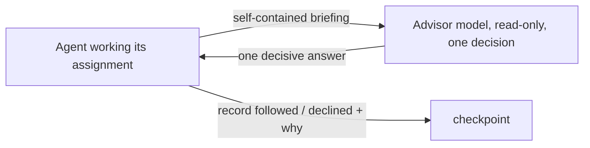

# Consulting your advisor

Follow the `swarm` skill first; this adds to it.

## When to consult
Before committing to an approach when more than one option looks reasonable. When an error keeps recurring or your reasoning has stopped converging. Before a step that's hard to undo — a migration, a delete, a force-push, telling your parent something is done. Orchestrators, debuggers and reviewers consult before every `completed`. Skip it for routine work that has one obvious way to do it: the advisor is for a real decision, not a rubber stamp.

## How to ask
Your advisor doesn't automatically share your context. A native Claude advisor call runs inside your own conversation and sees your full history; every other advisor — and a simulated call for any agent kind — gets a context file the daemon assembles fresh: your brief, recent checkpoints, open requests, and at most a truncated slice of your recent transcript, never the whole thing. Don't rely on either shape. Write your question and `focus` paths so the file carries everything a reader of only that slice would need:
- What you're deciding, in one sentence.
- The evidence you've gathered, with paths and line numbers — not a paraphrase.
- Your current approach, and the alternative(s) you're weighing.
- The exact question you want answered.
- What happens if the advice turns out wrong — the blast radius.

If you're asking for sign-off before `completed`, save your deliverable first: commit, write the file. The call takes real time; a durable result survives a dropped session, an unwritten one doesn't.

## Decision rules
- **One decision per consult.** Don't fold three unrelated questions into one call.
- **Advice is evidence, not authority.** Weigh it against what you've directly verified — a file's actual content beats a plausible-sounding claim about it.
- **At most one focused follow-up** if the first answer left a real gap. Don't loop.
- **Authoritative evidence wins.** When your own evidence and the advice conflict, go with what you can point to a path or line for — but say so out loud in your next checkpoint rather than silently picking a side.
- **Unresolved, high-impact uncertainty is not yours to guess through.** Send it up: your parent, or the user if you have none.

## Record the outcome
Your next checkpoint states what you did with the advice: followed it, or declined it and why. This is the only paper trail your parent or a later reviewer has for the decision — don't skip it even when you agreed with the advice.

---
Structure inspired by the `advisor` skill in scdenney/open-science-skills (CC BY-NC 4.0); this text is original.
